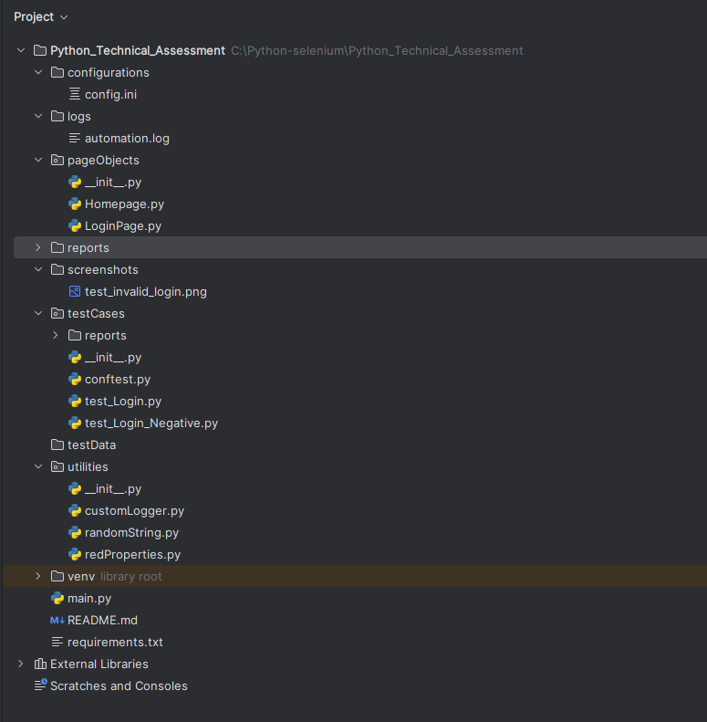

# 📌 Project Overview

This project automates the testing of a sample web application's login functionality using Selenium with Pytest. It includes test cases for both valid and invalid login scenarios and follows the Page Object Model (POM) for maintainability.

# 📋 Requirements

Python 3.x

Selenium

Pytest

Pytest-HTML (for test reports)

# **📂 Folder Structure**

# **🔧 Installation & Setup**

1. Clone the repository:

        git clone https://github.com/your-repo-url.git
        cd project-directory

2. Install dependencies:

        pip install -r requirements.txt

3. Configure test data:

        [commonInfo]
        baseURL = https://example.com
        email = test_user@example.com
        password = secure_password

# **🚀 Running the Tests**

1. Run all tests:

         pytest -v .\testCases

2. Run a specific test file:

        pytest -v .\testCases\test_Login_Negative.py

3. Running Tests on Different Browsers:

       pytest --browser chrome --html=report.html
       pytest --browser firefox --html=report.html
       pytest --browser edge --html=report.html

4. Running Tests in Headless Mode:
      
       pytest --browser chrome --headless --html=report.html
       pytest --browser firefox --headless --html=report.html

5. Running Tests in Parallel:

       pytest -n 4 --html=report.html

# **📜 Test Report**

   After execution, a report.html file will be generated, containing test results with pass/fail status and logs
   
# **🎯 Features Implemented**

✅ Page Object Model (POM)

✅ Headless Mode for CI/CD

✅ Logging Mechanism

✅ Screenshot Capture on Failure

✅ Pytest-HTML Reporting

✅ Explicit Waits (No Hardcoded Delays)

# **🛠 Future Enhancements**

✅ CI/CD Integration (e.g., GitHub Actions, Jenkins)

✅ Database Validation

✅ More Negative Scenarios